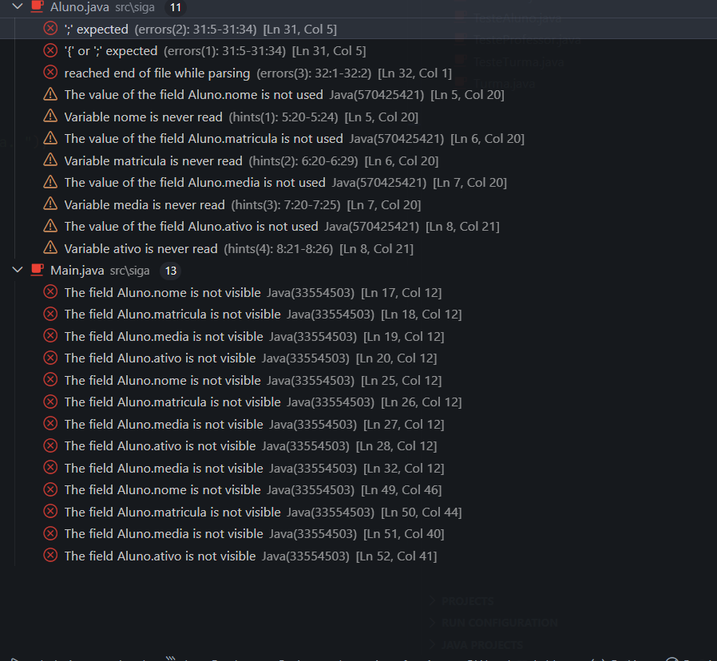
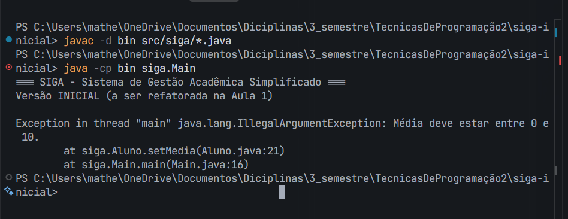
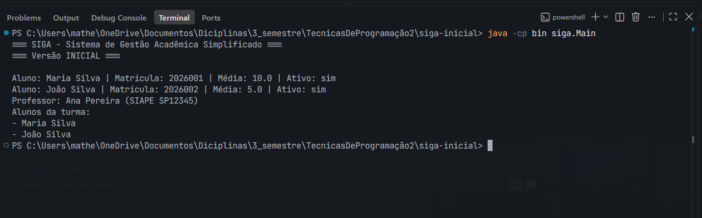
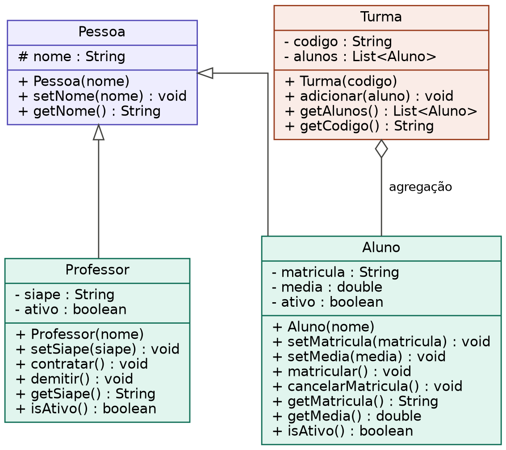

# Evidências — Atividade Prática Aula 1 (SIGA)

Este documento reúne as evidências pedidas na Seção 4 da ficha da atividade, uma por etapa.

## Etapa 1 — Identificação da violação de encapsulamento

Os atributos expostos como `public` na classe `Aluno` são: `nome`, `matricula`, `media` e `ativo`. Na classe `Professor`, são: `nome`, `siape` e `ativo`. Como esses atributos são públicos, qualquer código pode alterá-los diretamente, sem passar por nenhuma validação, colocando o objeto em um estado inválido.

Isso pode ser observado no `Main.java` original, onde as linhas `a2.media = -5;` e `a1.media = 15;` atribuem valores de média fora da faixa válida (uma média escolar deveria estar sempre entre 0 e 10). Como não existia nenhuma regra de validação nos atributos, o programa aceitava e executava essas atribuições normalmente, sem nenhum erro ou aviso — evidenciando a ausência de encapsulamento.

## Etapa 2 — Encapsulamento aplicado (estado protegido e validado)

A classe `Aluno` foi refatorada para atributos `private`, com setters que validam os dados antes de atribuir (`setNome`, `setMatricula` rejeitam valores nulos/vazios; `setMedia` rejeita valores fora da faixa 0–10).

Como evidência, a versão antiga do `Main.java` (que acessava os atributos diretamente, ex.: `a1.nome = "..."`) deixou de compilar assim que os atributos passaram a ser `private` — confirmando que a proteção está em vigor:

Além disso, em execução, a tentativa de atribuir uma média inválida (`-5` ou `15`) via `setMedia(...)` é rejeitada com `IllegalArgumentException`, interrompendo o programa no ponto exato do problema (ver evidência da Etapa 3, que já reflete essa mesma validação após a refatoração por herança).

## Etapa 3 — Herança aplicada (Pessoa → Aluno, Professor)

Criada a superclasse `Pessoa` (atributo `nome`, validado), da qual `Aluno` e `Professor` passaram a herdar, eliminando a duplicação de código entre as duas classes. Compilação e execução confirmando que a hierarquia funciona corretamente, com a validação de média ainda ativa:

## Etapa 4 — Composição aplicada (Turma agrega Aluno)

Criada a classe `Turma`, contendo uma lista de `Aluno` por composição (agregação, no sentido de que os alunos sobrevivem à exclusão da turma). O método `adicionar` valida `null` e duplicidade; `getAlunos()` retorna uma cópia defensiva da lista interna.

Execução completa demonstrando o sistema funcionando de ponta a ponta — alunos e professor criados com dados válidos, e a turma populada e listada corretamente:

## Etapa 5 — Diagrama de classes do domínio

Diagrama UML consistente com o código produzido, representando a herança (`Pessoa` → `Aluno`/`Professor`) e a agregação (`Turma` ◇— `Aluno`):

