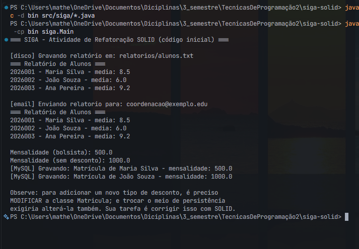
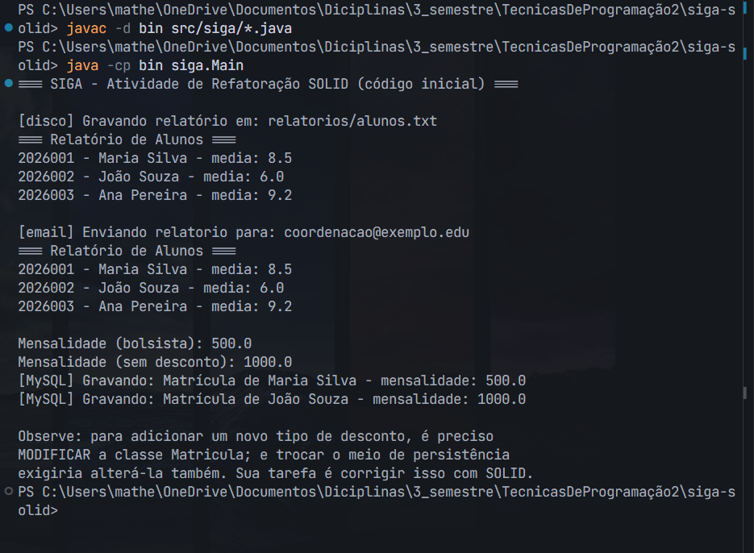
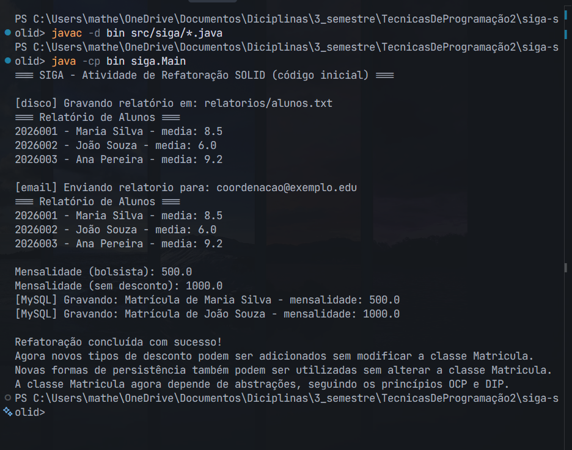

# Evidências — Atividade Prática Aula 3 (SIGA — SOLID)

Este documento reúne as evidências pedidas na Seção 4 da ficha da atividade, uma por etapa.

## Etapa 1 — Identificação da violação do SRP em `RelatorioAluno`

A classe `RelatorioAluno` viola o Princípio da Responsabilidade Única (SRP — Single Responsibility Principle) porque reúne responsabilidades que possuem motivos diferentes para mudar.

- **Formatação:** o método `formatar()` é responsável pela apresentação do relatório. Se a coordenação decidir que o relatório deve ser apresentado em tabela HTML em vez de texto puro, será necessário alterar essa classe.
- **Persistência:** o método `salvarEmArquivo()` é responsável pelo armazenamento. Se a instituição decidir trocar o armazenamento em arquivo por um banco de dados, também será necessário modificar a mesma classe.
- **Comunicação:** o método `enviarPorEmail()` é responsável pelo envio. Se o relatório passar a ser enviado pelo Microsoft Teams em vez de e-mail, novamente será necessário alterar `RelatorioAluno`.

O problema, portanto, não é simplesmente o fato de a classe "fazer três coisas". A violação do SRP ocorre porque três motivos independentes para mudança estão concentrados na mesma classe. Uma alteração na forma de apresentação, no mecanismo de persistência ou no meio de comunicação pode exigir mudanças em `RelatorioAluno`, mesmo que essas alterações não tenham relação entre si.

Para seguir o SRP, essas responsabilidades foram separadas em classes diferentes: `FormatadorRelatorioAluno`, `RepositorioRelatorio` e `ComunicadorRelatorio`. Assim, cada classe passou a ter um único motivo para mudar.

## Etapa 2 — SRP aplicado (responsabilidades separadas)

`RelatorioAluno` foi removida. Suas três responsabilidades foram movidas para `FormatadorRelatorioAluno`, `RepositorioRelatorio` e `ComunicadorRelatorio`, cada uma instanciada e usada de forma independente no `Main.java`.

Execução confirmando as três classes funcionando de forma coordenada:

## Etapa 3 — OCP aplicado (polimorfismo no lugar do bloco condicional)

O bloco de `if/else if/else` de `calcularMensalidade()` foi substituído pela interface `Desconto` (método `aplicar(double valor)`) e quatro implementações: `DescontoBolsista`, `DescontoConvenio`, `DescontoFuncionario` e `SemDesconto`. A classe `Matricula` passou a receber o desconto por injeção no construtor, sem conhecer os tipos concretos.

Execução confirmando os cálculos corretos via polimorfismo (bolsista: 500.0; sem desconto: 1000.0):

## Etapa 4 — DIP aplicado (dependência de abstração)

Criada a interface `MatriculaRepositorio` (método `gravar(String dados)`). `GravadorMySQL` passou a implementar essa interface, e `Matricula` deixou de criar `new GravadorMySQL()` internamente — agora recebe a implementação via injeção no construtor, dependendo apenas da abstração.

Execução confirmando o sistema completo funcionando, sem erros ou avisos do compilador:

## Etapa 5 — Diagnóstico dos code smells

No código original foram identificados os seguintes indícios de mau cheiro de código:

- **God Class (Classe Deus):** a classe `RelatorioAluno` concentrava várias responsabilidades, como formatar o relatório, salvar em arquivo e enviar por e-mail. Isso indica que a classe possui responsabilidades e conhecimentos em excesso.
- **Conditional Complexity (Complexidade Condicional):** o método `calcularMensalidade()` utilizava vários `if/else if/else` para verificar o tipo de desconto. Essa estrutura torna o código mais difícil de manter e ampliar quando novos tipos de desconto são adicionados.
- **Acoplamento forte com implementação concreta:** `Matricula` criava diretamente um objeto `GravadorMySQL` com `new GravadorMySQL()`. Além de dificultar a troca da forma de persistência, isso também prejudica a testabilidade, pois não era possível fornecer facilmente uma implementação falsa do repositório durante os testes.

Esses code smells serviram como indícios para identificar posteriormente as violações dos princípios SOLID e orientar as refatorações realizadas nas etapas anteriores.
