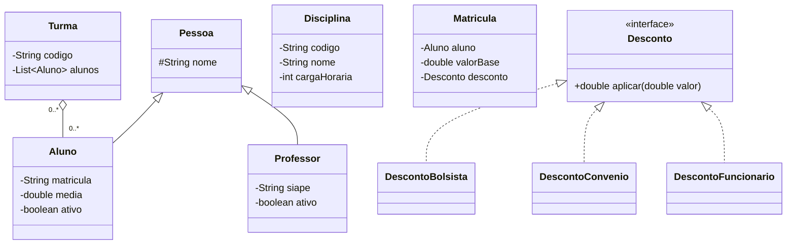
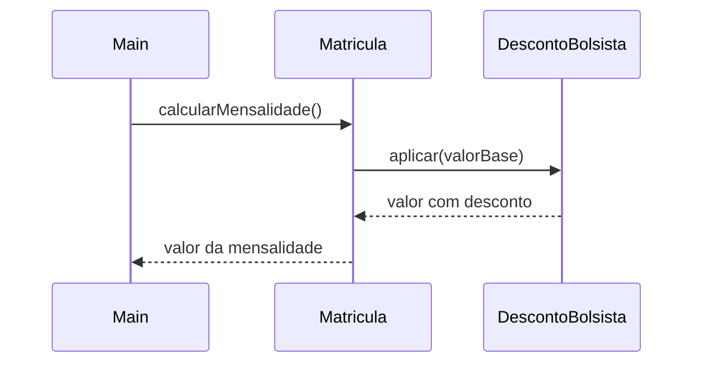

# Diagrama UML do domínio do SIGA — Aula 4

## Diagrama de classes

```mermaid
classDiagram
    class Pessoa {
        #String nome
    }
    class Aluno {
        -String matricula
        -double media
        -boolean ativo
    }
    class Professor {
        -String siape
        -boolean ativo
    }
    class Turma {
        -String codigo
        -List~Aluno~ alunos
    }
    class Disciplina {
        -String codigo
        -String nome
        -int cargaHoraria
    }
    class Matricula {
        -Aluno aluno
        -double valorBase
        -Desconto desconto
    }
    class Desconto {
        <<interface>>
        +double aplicar(double valor)
    }

    Pessoa <|-- Aluno
    Pessoa <|-- Professor
    Turma "0..*" o-- "0..*" Aluno
    Desconto <|.. DescontoBolsista
    Desconto <|.. DescontoConvenio
    Desconto <|.. DescontoFuncionario
```

## Diagrama de sequência — cálculo da mensalidade

```mermaid
sequenceDiagram
    Main->>Matricula: calcularMensalidade()
    Matricula->>DescontoBolsista: aplicar(valorBase)
    DescontoBolsista-->>Matricula: valor com desconto
    Matricula-->>Main: valor da mensalidade
```
