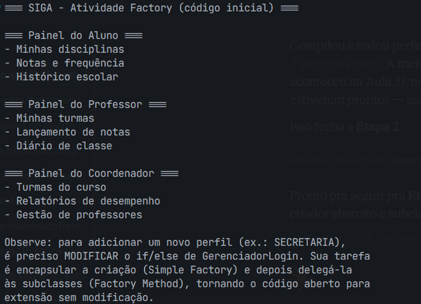
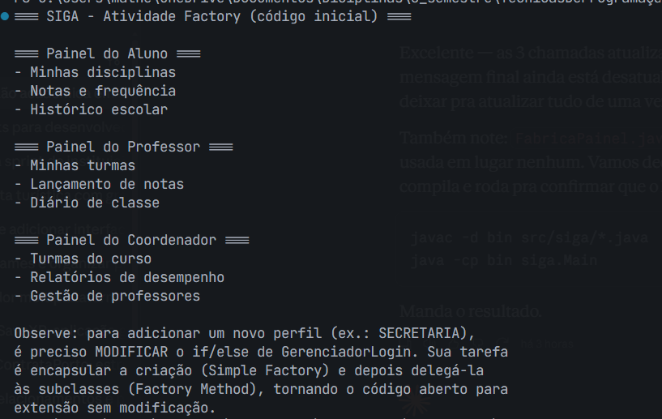
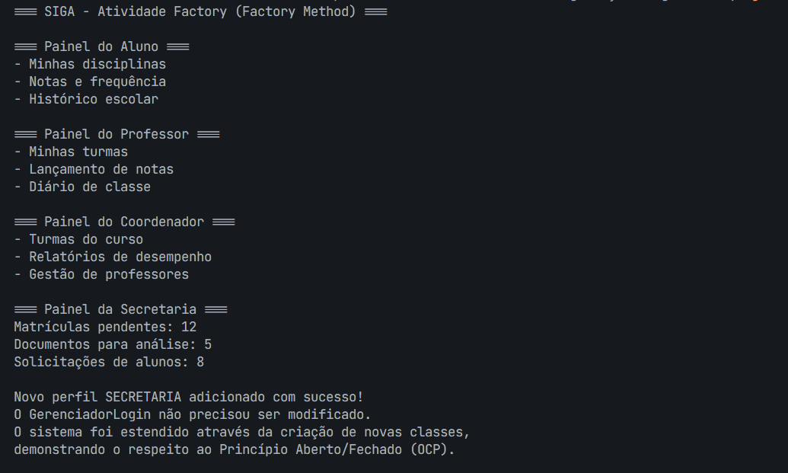

# Evidências — Atividade Prática Aula 5 (SIGA — Factory Method)

Este documento reúne as evidências pedidas na Seção 4 da ficha da atividade, uma por etapa.

## Etapa 1 — Diagnóstico do acoplamento e violação do OCP

O problema encontrado na classe `GerenciadorLogin` é a violação do Princípio Aberto/Fechado (OCP). Isso acontece porque o método `montarPainel` precisa ser alterado sempre que um novo perfil de usuário é adicionado.

No código original, o método possuía o seguinte bloco de `if/else`:

```java
if (tipoUsuario.equals("ALUNO")) {
    painel = new PainelAluno();
} else if (tipoUsuario.equals("PROFESSOR")) {
    painel = new PainelProfessor();
} else if (tipoUsuario.equals("COORDENADOR")) {
    painel = new PainelCoordenador();
} else {
    throw new IllegalArgumentException("Perfil desconhecido: " + tipoUsuario);
}
```

Esse trecho mostra claramente o problema porque o `GerenciadorLogin` é responsável por verificar o tipo do usuário e também por instanciar diretamente cada painel. Um cenário concreto seria se a instituição decidisse adicionar um novo perfil chamado `SECRETARIA`. Nesse caso, seria necessário modificar o método `montarPainel` e adicionar mais uma condição, além de criar a nova classe `PainelSecretaria`. O `GerenciadorLogin`, que já estava funcionando, precisaria ser alterado para reconhecer esse novo perfil — isso viola o OCP porque a classe não está fechada para modificações.

Além disso, existe um problema de acoplamento: o `GerenciadorLogin` conhecia diretamente as classes concretas `PainelAluno`, `PainelProfessor` e `PainelCoordenador`. Mesmo existindo a interface `Painel`, ele não dependia somente dessa abstração — precisava conhecer cada classe concreta para decidir qual objeto criar.

Em resumo, o OCP era violado porque novos perfis obrigavam a modificar o método `montarPainel`, e o acoplamento acontecia porque `GerenciadorLogin` dependia diretamente das classes concretas de painel.

## Etapa 2 — Simple Factory aplicada

Criada a classe `FabricaPainel`, com o método `criar(String tipoUsuario)` centralizando a decisão de qual `Painel` instanciar. `GerenciadorLogin` passou a delegar a criação para a fábrica, em vez de decidir sozinho.

Execução confirmando os 3 perfis funcionando através da Simple Factory:



## Etapa 3 — Factory Method aplicado

Criada a classe abstrata `CriadorPainel` (com o método abstrato `criarPainel()`) e as subclasses concretas `CriadorPainelAluno`, `CriadorPainelProfessor` e `CriadorPainelCoordenador`. `GerenciadorLogin` deixou de conhecer qualquer classe concreta — passou a receber um `CriadorPainel` já pronto, e a decisão de qual criador usar foi movida para o código cliente (`Main.java`). A classe `FabricaPainel` foi removida por não ser mais utilizada.

Execução confirmando o Factory Method funcionando, sem nenhum `if/else` decidindo por texto:



## Etapa 4 — Novo perfil sem modificar código existente (OCP demonstrado)

Adicionado o perfil `SECRETARIA` criando **apenas dois arquivos novos**: `PainelSecretaria` (implementa `Painel`) e `CriadorPainelSecretaria` (estende `CriadorPainel`). Nenhum arquivo já existente foi modificado — apenas o `Main.java` foi alterado para usar o novo criador, o que é esperado (é o código cliente, não parte da hierarquia de criação).

Execução confirmando os 4 perfis funcionando, incluindo o novo perfil Secretaria, sem qualquer alteração em `GerenciadorLogin`, `CriadorPainel` ou nos criadores/painéis já existentes:



## Etapa 5 — Diagrama de classes da solução final

Diagrama UML consistente com o código produzido, disponível em [`diagrama-solucao.md`](diagrama-solucao.md), representando:
- A interface `Painel` e suas 4 implementações (realização);
- A classe abstrata `CriadorPainel` e suas 4 subclasses (herança);
- A dependência entre cada criador concreto e o painel que ele especificamente cria.
