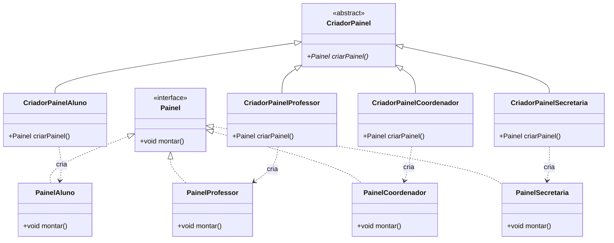

# Diagrama de classes — Solução Factory Method (Aula 5)

```mermaid
classDiagram

    class Painel {
        <<interface>>
        +void montar()
    }

    class PainelAluno {
        +void montar()
    }

    class PainelProfessor {
        +void montar()
    }

    class PainelCoordenador {
        +void montar()
    }

    class PainelSecretaria {
        +void montar()
    }

    Painel <|.. PainelAluno
    Painel <|.. PainelProfessor
    Painel <|.. PainelCoordenador
    Painel <|.. PainelSecretaria

    class CriadorPainel {
        <<abstract>>
        +Painel criarPainel()*
    }

    class CriadorPainelAluno {
        +Painel criarPainel()
    }

    class CriadorPainelProfessor {
        +Painel criarPainel()
    }

    class CriadorPainelCoordenador {
        +Painel criarPainel()
    }

    class CriadorPainelSecretaria {
        +Painel criarPainel()
    }

    CriadorPainel <|-- CriadorPainelAluno
    CriadorPainel <|-- CriadorPainelProfessor
    CriadorPainel <|-- CriadorPainelCoordenador
    CriadorPainel <|-- CriadorPainelSecretaria

    CriadorPainelAluno ..> PainelAluno : cria
    CriadorPainelProfessor ..> PainelProfessor : cria
    CriadorPainelCoordenador ..> PainelCoordenador : cria
    CriadorPainelSecretaria ..> PainelSecretaria : cria
```
