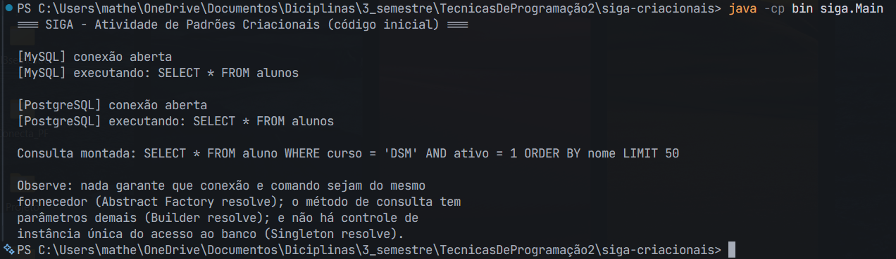
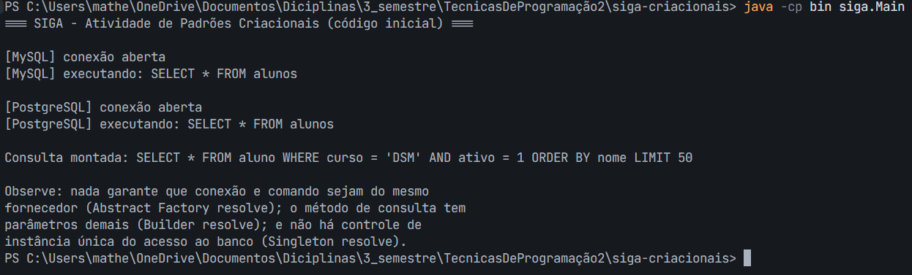
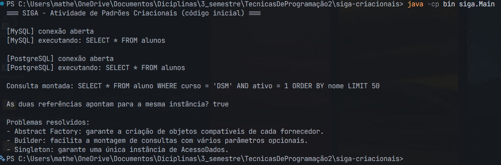

# Evidências — Atividade Prática Aula 6 (SIGA — Abstract Factory, Builder, Singleton)

Este documento reúne as evidências pedidas na Seção 4 da ficha da atividade, uma por etapa.

**Observação sobre a ficha e o código:** existe uma diferença entre o contexto apresentado na ficha e o código da atividade. Na ficha, o contexto fala sobre documentos (histórico, declaração, certificado, variações impressão/tela), mas no código que foi fornecido o exemplo trabalha com banco de dados, usando conexões e comandos de fornecedores como MySQL e PostgreSQL. Por isso, o diagnóstico e a refatoração consideraram o que realmente está implementado no código.

## Etapa 1 — Diagnóstico dos dois problemas

**Mistura de fornecedores:** o método `conectar` tinha um problema porque criava a conexão e o comando em blocos `if/else` separados. Hoje isso funcionava, mas poderia causar problemas na manutenção do código. Por exemplo, se no futuro alguém estivesse alterando o código e trocasse por engano apenas uma das linhas do `if`, poderia acabar criando uma `ConexaoMySQL` junto com um `ComandoPostgreSQL` — os dois objetos seriam de fornecedores diferentes. O código não garantia que a conexão e o comando sempre fossem da mesma família. Para resolver esse problema, foi utilizado o padrão Abstract Factory, que permite criar objetos relacionados do mesmo fornecedor, garantindo que a conexão e o comando sejam compatíveis entre si.

**Construtor telescópico:** a chamada `acesso.montarConsulta("aluno", "curso = 'DSM'", "nome", 50, 0, 30, true)` era difícil de entender porque possuía vários parâmetros e, principalmente, porque os números e o `boolean` não deixavam claro o que representavam. Isso também poderia causar erros, porque alguém poderia trocar a ordem dos valores ou colocar um valor errado sem perceber. O padrão Builder ajudou a resolver esse problema, permitindo configurar cada informação de forma mais clara, deixando a montagem da consulta mais fácil de entender e de manter.

## Etapa 2 — Abstract Factory aplicado

Criada a classe abstrata `FabricaBanco` (com os métodos `criarConexao()` e `criarComando()`) e as fábricas concretas `FabricaMySQL` e `FabricaPostgreSQL`, cada uma produzindo produtos coerentes do mesmo fornecedor. O método `AcessoDados.conectar` passou a decidir apenas qual fábrica usar, obtendo os dois produtos da mesma fábrica.

Execução confirmando a Abstract Factory funcionando, com conexão e comando sempre do mesmo fornecedor:

## Etapa 3 — Builder aplicado

Criada a classe `ConsultaBuilder`, com a tabela obrigatória no construtor e métodos encadeáveis (`comFiltro`, `comOrdenacao`, `comLimite`, `comOffset`, `comTimeoutSegundos`, `somenteAtivos`) para os parâmetros opcionais, finalizando com `construir()`. O método `montarConsulta` (telescópico) foi removido de `AcessoDados`.

Execução confirmando a mesma consulta SQL sendo gerada de forma legível pelo Builder:

## Etapa 4 — Singleton aplicado

`AcessoDados` foi transformado em Singleton: construtor privado, atributo estático `instancia`, e o método de acesso controlado `getInstancia()` com inicialização tardia (lazy initialization).

Execução confirmando, através de um teste de identidade (`==`), que duas chamadas a `getInstancia()` retornam exatamente o mesmo objeto:

## Etapa 5 — Diagrama de classes da solução final

Diagrama UML consistente com o código produzido, disponível em [`diagrama-solucao.md`](diagrama-solucao.md), representando:
- As interfaces `Conexao` e `Comando`, com as 4 implementações concretas (realização);
- A classe abstrata `FabricaBanco` e as fábricas concretas `FabricaMySQL`/`FabricaPostgreSQL` (herança);
- A classe `ConsultaBuilder` completa, com todos os métodos fluentes;
- A classe `AcessoDados`, evidenciando o Singleton (membros estáticos) e suas dependências das demais peças da solução.
