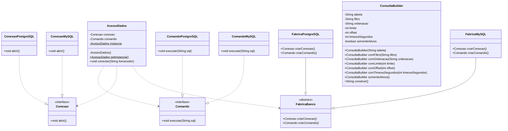

# Diagrama de classes — Solução Abstract Factory + Builder + Singleton (Aula 6)

```mermaid
classDiagram

    class Conexao {
        <<interface>>
        +void abrir()
    }

    class Comando {
        <<interface>>
        +void executar(String sql)
    }

    class ConexaoMySQL {
        +void abrir()
    }

    class ComandoMySQL {
        +void executar(String sql)
    }

    class ConexaoPostgreSQL {
        +void abrir()
    }

    class ComandoPostgreSQL {
        +void executar(String sql)
    }

    ConexaoMySQL ..|> Conexao
    ComandoMySQL ..|> Comando
    ConexaoPostgreSQL ..|> Conexao
    ComandoPostgreSQL ..|> Comando

    class FabricaBanco {
        <<abstract>>
        +Conexao criarConexao()*
        +Comando criarComando()*
    }

    class FabricaMySQL {
        +Conexao criarConexao()
        +Comando criarComando()
    }

    class FabricaPostgreSQL {
        +Conexao criarConexao()
        +Comando criarComando()
    }

    FabricaMySQL --|> FabricaBanco
    FabricaPostgreSQL --|> FabricaBanco

    class ConsultaBuilder {
        -String tabela
        -String filtro
        -String ordenacao
        -int limite
        -int offset
        -int timeoutSegundos
        -boolean somenteAtivos
        +ConsultaBuilder(String tabela)
        +ConsultaBuilder comFiltro(String filtro)
        +ConsultaBuilder comOrdenacao(String ordenacao)
        +ConsultaBuilder comLimite(int limite)
        +ConsultaBuilder comOffset(int offset)
        +ConsultaBuilder comTimeoutSegundos(int timeoutSegundos)
        +ConsultaBuilder somenteAtivos()
        +String construir()
    }

    class AcessoDados {
        -Conexao conexao
        -Comando comando
        -AcessoDados instancia$
        -AcessoDados()
        +AcessoDados getInstancia()$
        +void conectar(String fornecedor)
    }

    AcessoDados ..> FabricaBanco
    AcessoDados ..> Conexao
    AcessoDados ..> Comando
```
