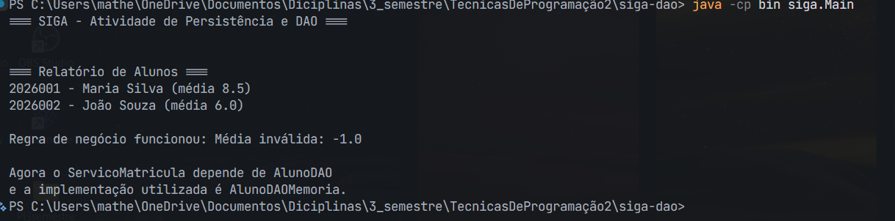
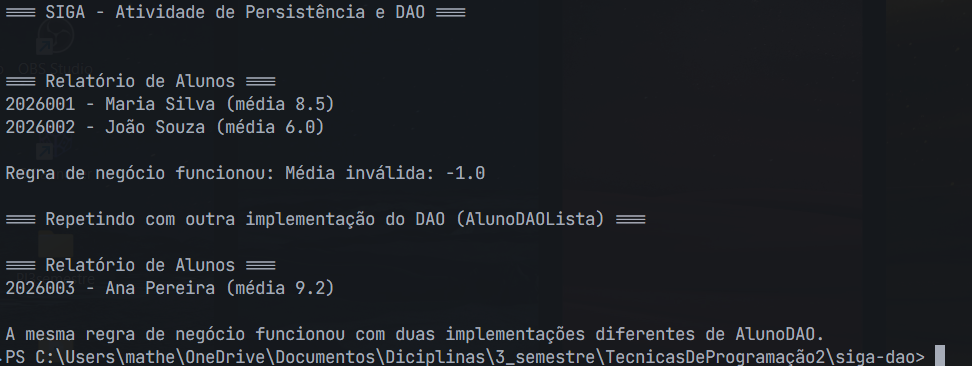

# Evidências — Atividade Prática Aula 7 (SIGA — Padrão DAO)

Este documento reúne as evidências pedidas na Seção 4 da ficha da atividade, uma por etapa.

## Etapa 1 — Diagnóstico dos três problemas

**Violação do SRP:** o método `matricular()` possui mais de uma responsabilidade. Ele primeiro cuida de uma regra de negócio, que é validar se a média do aluno está entre 0 e 10, mas depois também monta e executa um comando SQL para salvar o aluno no banco. Um cenário de mudança seria se a estrutura da tabela `aluno` fosse alterada — nesse caso, seria necessário modificar a classe `ServicoMatricula`, mesmo que nenhuma regra acadêmica tivesse mudado.

**Violação do DIP:** `ServicoMatricula` depende diretamente da classe concreta `BancoSimulado`, através de chamadas como `BancoSimulado.executar()` e `BancoSimulado.consultar()`. Se futuramente a instituição decidisse trocar o banco ou a tecnologia de persistência, o `ServicoMatricula` precisaria ser alterado. O ideal seria o serviço depender de uma abstração, como uma interface `AlunoDAO`, permitindo trocar a implementação sem alterar a regra de negócio.

**Duplicação de código:** o mesmo acesso a dados aparece em `matricular()` e em `gerarRelatorio()`. O risco é que, em uma manutenção futura, seja necessário alterar a forma como os dados são acessados e apenas um dos trechos seja atualizado, causando comportamentos diferentes ou erros.

**Conclusão:** os três problemas estão relacionados ao excesso de responsabilidades e acoplamento dentro do `ServicoMatricula`. A classe deveria se concentrar na regra de negócio da matrícula e deixar o acesso aos dados para uma abstração de DAO.

## Etapa 2 — Interface `AlunoDAO`

Definida a interface `AlunoDAO`, com os métodos `inserir(Aluno)`, `buscarPorMatricula(String)`, `listarTodos()`, `atualizar(Aluno)` e `remover(String)` — todos escritos na linguagem do domínio, sem nenhum termo de SQL.

## Etapa 3 — `AlunoDAOMemoria`

Implementada `AlunoDAOMemoria`, guardando os alunos em um `Map<String, Aluno>` (usando a matrícula como chave), funcional sem necessidade de banco de dados real.

## Etapa 4 — `ServicoMatricula` refatorado

`ServicoMatricula` passou a receber o `AlunoDAO` pelo construtor. O método `matricular()` manteve apenas a validação de média, delegando a persistência a `dao.inserir(aluno)`. O método `gerarRelatorio()` passou a usar `dao.listarTodos()`. Toda referência a `BancoSimulado` e SQL foi removida.

Execução confirmando a regra de negócio funcionando através da abstração, incluindo a rejeição de uma média inválida:

## Etapa 5 — Troca de implementação sem alterar a regra de negócio

Criada uma segunda implementação, `AlunoDAOLista` (usando `List<Aluno>` em vez de `Map`). O `Main.java` foi ajustado para instanciar um segundo `ServicoMatricula` com essa nova implementação — **sem nenhuma alteração em `ServicoMatricula.java`**.

Execução confirmando que a mesma regra de negócio funciona igualmente com as duas implementações do DAO:

